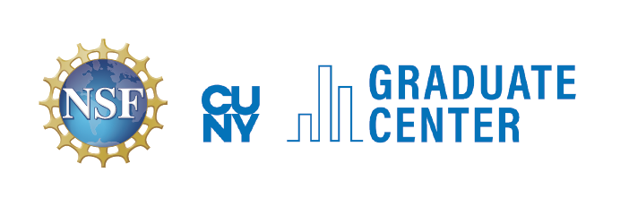

# Four Decades of the Einstein Chair Seminar

The conference is being held on Jan 17-19, 2023 at CUNY Graduate Center.

---

**Entering the Graduate Center building:**  
You must have ID and proof of vaccination (WHO approved vaccines are acceptable). If you are not vaccinated then you need a negative PCR  test taken within seven days of entry.  CUNY members need to have a Cleared 4 pass.

---

---

**Confirmed Speakers**  
[Richard Canary (University of Michigan)](http://www.math.lsa.umich.edu/~canary/){target="_blank"}  
[Moira Chas (Stony Brook University)](http://www.math.stonybrook.edu/~moira/){target="_blank"}  
[Ralph Cohen (Stanford University)](http://math.stanford.edu/~ralph/){target="_blank"}   
[Gregory Falkovich (Weizmann Institute of Science)](https://www.weizmann.ac.il/complex/falkovich/home){target="_blank"}  
[Edson de Faria (University of Sao Paulo)](https://www.ime.usp.br/~edson/edson.html){target="_blank"}  
[Ruth Lawrence-Naimark (Einstein Institute of Mathematics, Hebrew University)](https://math.huji.ac.il/~ruthel/){target="_blank"}  
[Camillo de Lellis (Institute of Advanced Study)](https://www.math.ias.edu/delellis/node/1){target="_blank"}  
[Hee Oh (Yale University)](https://gauss.math.yale.edu/~ho2/){target="_blank"}  
[Manuel Rivera (Purdue University)](https://riveramanuel.com/){target="_blank"}  
[Nathan Seiberg (Institute of Advanced Study)](https://www.ias.edu/scholars/seiberg){target="_blank"}  
[Nathalie Wahl (University of Copenhagen)](http://web.math.ku.dk/~wahl/){target="_blank"}   
[Amie Wilkinson (University of Chicago)](https://math.uchicago.edu/~wilkinso/){target="_blank"} 

---

**Organizers**  
[Ara Basmajian](https://sites.google.com/view/basmajian/home){target="_blank"}, [Bora Ferlengez](mailto:bora.ferlengez@gmail.com){target="_blank"}, [Frederick Gardiner](http://userhome.brooklyn.cuny.edu/gardiner/){target="_blank"}, [Yunping Jiang](http://qcpages.qc.cuny.edu/~yjiang/){target="_blank"}, [Jun Hu](http://userhome.brooklyn.cuny.edu/junhu/){target="_blank"},  
[Linda Keen](http://comet.lehman.cuny.edu/keenl/){target="_blank"}, [Ilya Kofman](https://www.math.csi.cuny.edu/~ikofman/){target="_blank"}, [Vincent Martinez](http://math.hunter.cuny.edu/vmartine/){target="_blank"}, [Scott Wilson](https://qcpages.qc.cuny.edu/~swilson/){target="_blank"}, [Mahmoud Zeinalian](https://www.zeinalian.com/){target="_blank"}  

---

Many thanks Karen Marinez, Debbie Silverman, Velvet Lattimore for their help and Ryan Utke for recording the videos.

---

